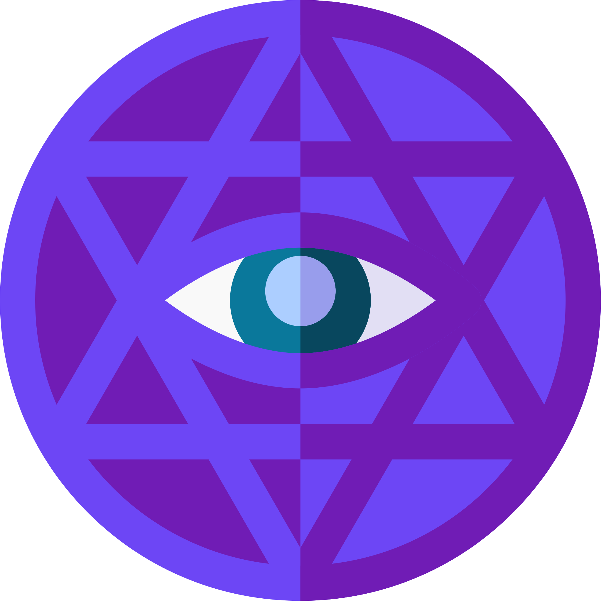

# magic



Magic is a Golang web framework that simplifies web development.
With under 12kb JavaScript, it's powerful yet easy to use for building
efficient web applications.

# Getting started


For a simple live counter example:

> main.go
```go
package main

func main() {
    mux := http.NewServeMux()
	mux.Handle("/", magic.ComponentHTTPHandler(home))
	log.Print("Listening to http://localhost:8070")
	if err := http.ListenAndServe(":8070", mux); err != nil {
		log.Fatal(err)
	}
}
```

> home.go
```go
package main

import (
	"time"

	"github.com/Instantan/magic"
)

var homeView = magic.View(`
	<!DOCTYPE html>
	<html>
	<head>
		<title>Time</title>
	</head>
	<body>
		<p>{{time}}</p>
	</body>
	</html>
`)

var home = magic.Component(func(s magic.Socket, e magic.Empty) magic.AppliedView {
	magic.UseLiveRoutine(s, func(quit <-chan struct{}) {
		t := time.NewTicker(time.Millisecond * 1000)
		for {
			select {
			case c := <-t.C:
				magic.Assign(s, "time", c.String())
			case <-quit:
                t.Stop()
                return
			}
		}
	})
	return homeView(s)
})

```

# Roadmap

- Implement temporal data patches
- Clean up socket.go, ref.go and view.go
- Benchmarking, memory reduction and performance improvements
- Unit tests
